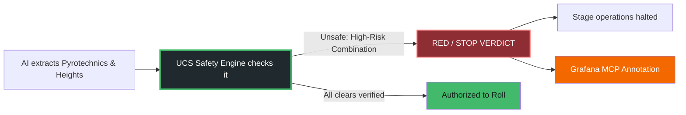
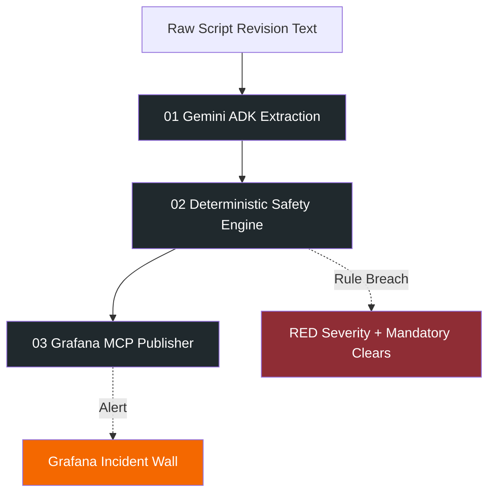
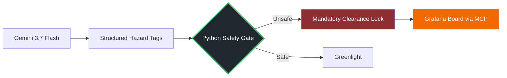

<div align="center">
  <!-- UCS Brand Logo -->
  <picture>
    
  </picture>

  <h1>AI extracts the hazards. Python decides if it is safe.</h1>
  <p><i>A deterministic, offline-capable safety governance agent for film production.</i></p>

  [](#)
  [](#)
  [](#)
  [](#)
</div>

## 🚀 Quick Links

**[1. Watch the 3-Minute Demo Video](#)** | **[2. Launch Live Demo Portal](#)** | **[3. Explore Source Code](#)**

For evaluators and safety professionals: watch the short 3-minute demo to see exactly how UCS stops a dangerous script change from reaching the film set.

<div align="center">
  <a href="#">
    
  </a>
  <br>
  <b>Universal CallSheet Demo Video</b>
</div>
<br/>

> **TL;DR:** Ninety-five percent of films take multiple rewrites before shooting. When a script changes, the hazard assessment must change. An AI may extract the narrative changes and suggest hazards, but it never makes the final legal safety decision. UCS runs the extracted hazards through deterministic Alberta OHS Code rules and pushes a hard STOP to the Grafana Incident Wall.

### ⚡ The Core Workflow



This is the product in one sentence: **creative reasoning is allowed upstream; deterministic permission is required downstream.**

## ✨ Why Universal CallSheet (UCS)?

Generative models are phenomenal at parsing unstructured script text into structured data, but they are not a safe place to put final authority over human lives on a film set. UCS gives the model a narrow job and gives the execution path hard boundaries:

- 🧠 **Smart Extraction:** The model emits a constrained Pydantic schema (Diffs, Department Deltas, Hazard Tags), not a final safety verdict.
- 🏗️ **Deterministic Assembly:** Pure Python code evaluates the extracted tags against the Alberta Occupational Health and Safety (OHS) Code.
- 🛑 **Strict Validation:** A combination of Row 2 (Pyro) and Row 9 (Heights > 3m) immediately triggers a `RED` severity.
- 🔐 **Bounded Dispatch:** The official Grafana MCP server pushes the immutable incident annotation to the self-hosted production wall.

The experience is designed to make a technical safety property feel obvious to any non-technical user: **the system proves what it detected, why it halted production, and exactly which department heads must sign off.**

## 🎥 Interactive Demonstration

The deployed portal is a guided, static replay backed by repository evidence. It does not contain live keys or require a python backend to run (offline fallback caching).

| Step | What you will see | Why it matters |
| --- | --- | --- |
| 1 | A script revision introducing an explosion and a 20-foot fall | A concrete liability failure, not an abstract architecture diagram |
| 2 | Extracted Department Deltas (SPFX, Stunts, Grip) | The AI successfully translated narrative to logistics |
| 3 | A hard `RED / STOP` master verdict | The refusal is perfectly transparent and rule-bound |
| 4 | 5 Mandatory Department Sign-offs | The human explanation maps directly to OHS compliance |
| 5 | The Raw JSON backend payload | The system proves the AI extraction and the deterministic engine output |

## 🛤️ The 3-Step Pipeline



## 🧾 Verification Ledger

We use a strict vocabulary so the README does not make a stronger claim than the code or receipt supports.

<table>
  <tr>
    <td width="50%">
      <h3>🔴 Live: Deterministic Refusal</h3>
      <p><strong>The Python engine blocks authorization, not the LLM.</strong> Backed by <code>src/engine/safety.py</code> and the test suite.</p>
    </td>
    <td width="50%">
      <h3>🛡️ Live: Grafana MCP Telemetry</h3>
      <p><strong>Incident annotations are pushed to Grafana.</strong> Backed by <code>grafana_client.py</code> using the official MCP protocol.</p>
    </td>
  </tr>
  <tr>
    <td width="50%">
      <h3>🚫 Tested: Fallback Offline Caching</h3>
      <p><strong>If internet drops on location, the HUD still works.</strong> Proven by <code>public/output.json</code> and frontend defensive rendering.</p>
    </td>
    <td width="50%">
      <h3>✅ Verified: Structured Schema</h3>
      <p><strong>Gemini is constrained to output Pydantic schemas only.</strong> Backed by <code>src/agent/models.py</code>.</p>
    </td>
  </tr>
</table>

## 🏗️ Architecture in Plain English



The model is useful because it extracts hazards from narrative text. The Python path is trusted because it owns the final OHS compliance rules and the Grafana dispatch.

## 🔍 Hackathon Evaluation Guide

**Best-practice inference:** Hackathon judges tend to reward a focused problem, a working public demo, meaningful technology use, originality, and a clear explanation. This README makes each visible in the same order a judge experiences the submission:

<table>
  <tr>
    <td width="50%">
      <h3>🎯 What problem is solved?</h3>
      <p>Script changes cause deaths because hazards aren't reassessed. We fix this.</p>
    </td>
    <td width="50%">
      <h3>⏱️ Can I understand it quickly?</h3>
      <p>One script revision, one RED stop, one Grafana alert.</p>
    </td>
  </tr>
  <tr>
    <td width="50%">
      <h3>💻 Is the technology meaningful?</h3>
      <p>Python rules own the final permission path; AI does not make legal safety choices.</p>
    </td>
    <td width="50%">
      <h3>🧾 Is there proof?</h3>
      <p>Code references, backend JSON receipts, and a reproducible test session.</p>
    </td>
  </tr>
  <tr>
    <td colspan="2">
      <h3>🧠 What is memorable?</h3>
      <p>The system proves that an explosion and a high fall were caught instantly and halted the entire set until signed off.</p>
    </td>
  </tr>
</table>

## 💻 Run Locally

The proof portal is plain static HTML and can be opened directly or served from the repository root. 

```bash
# 1. Install dependencies
pip install -e .

# 2. Add Credentials to .env
GEMINI_API_KEY="your_api_key"
GEMINI_MODEL="gemini-3.7-flash"
GRAFANA_URL="http://localhost:3000"
GRAFANA_API_KEY="glsa_your_token"

# 3. Run the test suite
pytest tests/

# 4. Start the Application & API Server
python src/main.py
# Open http://localhost:8000 in your browser
```

## 🔗 Project Architecture & Ownership

* **[Sean Morin](https://github.com/deveraux-dev)** ([deveraux.dev](https://deveraux.dev)) — System Architecture, Domain Safety Engineering & OHS Regulatory Philosophy
* **[Sehrish Majeed](https://github.com/sehrishmajeed)** — Agentic AI Implementation, Google ADK Pipeline & Grafana MCP Integration

*Disclaimer: This is a hackathon prototype for safety workflow assistance. It is not legal advice. Final authority remains with production safety leadership and applicable regulators.*
