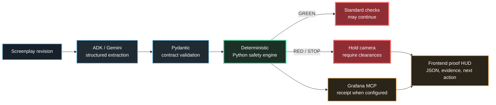

<p align="center">
  
</p>

<h1 align="center">Universal CallSheet</h1>

<p align="center">
  <strong>AI structures screenplay changes. Deterministic safety rules decide whether the camera can roll.</strong>
</p>

<p align="center">A proof-first safety review cockpit for film productions.</p>

<p align="center">
  <a href="https://universal-callsheet.vercel.app">Live app</a>
  &nbsp; | &nbsp;
  <a href="https://youtu.be/XzUXE0kLOAs">Demo video</a>
  &nbsp; | &nbsp;
  <a href="docs/ARCHITECTURE.md">Architecture</a>
  &nbsp; | &nbsp;
  <a href="docs/DEVPOST_SUBMISSION.md">Submission copy</a>
</p>

<p align="center">
  <code>Google ADK</code>
  <code>Gemini</code>
  <code>FastAPI</code>
  <code>Python safety engine</code>
  <code>Grafana MCP</code>
  <code>Vercel</code>
</p>

## The Product

A late screenplay revision can introduce a firearm, smoke, a confined space, a stunt, or powered equipment after the production plan is already in motion. Universal CallSheet turns that revision into a reviewable production record:

`changed text -> affected departments -> hazard evidence -> stage decision -> required clearances -> receipt`

The memorable outcome is intentionally simple: when a critical hazard is present, the system says `STOP`, explains why, and shows what must happen next.

## See The Proof First

| Start here | What it proves |
| --- | --- |
| [Open the live app](https://universal-callsheet.vercel.app) | The deployed review cockpit and S2 proof path |
| [Watch the 99-second demo](https://youtu.be/XzUXE0kLOAs) | The product story and end-to-end interaction |
| Select `S2` in the scenario deck | A confined-space firearm revision reaches `STOP` |
| Open `Raw backend JSON` | The visible result comes from the FastAPI contract |
| Open `Receipt and chain` | Runtime mode, safety ownership, and Grafana status are explicit |

### The 60-second judge path

1. Open the live app and keep `Auto-review` enabled.
2. Select `S2: Confined Space Prop Firearm Shootout`.
3. Watch the revision move through structured analysis and the deterministic safety engine.
4. Read the `STOP` decision, affected teams, and required clearances.
5. Open the evidence panels and raw JSON to verify the result instead of trusting a claim.

## The Core Flow



## Why The Boundary Matters

The model is useful for interpreting ambiguous screenplay language. It is not trusted with the final permission decision.

| Layer | Responsibility | Evidence in this repo |
| --- | --- | --- |
| Google ADK / Gemini | Extract changes, department impact, and governed hazard tags | `src/agent/pipeline.py`, `src/agent/models.py` |
| Pydantic contracts | Reject malformed structured output | `src/agent/models.py`, API tests |
| Python safety engine | Map hazard rows to `GREEN`, `REVIEW`, `RED`, or `STOP` | `src/engine/safety.py` |
| Grafana MCP adapter | Publish significant results as an annotation when configured | `src/engine/grafana_client.py` |
| Frontend HUD | Show the decision, evidence, provenance, and next action | `public/index.html`, `public/app.js` |

The frontend checklist records sign-off progress; it cannot override a backend `STOP` verdict. That rule is covered by a browser regression test.

## Verified Visual Receipt

The local Grafana path was verified with a Backlot Safety Wall showing scene severity and open locks. Hosted Grafana publishing is supported, but the live app labels it as published only when the current backend request returns a receipt.

<p align="center">
  
</p>

## Evidence Status

| Capability | Status | Source of truth |
| --- | --- | --- |
| Vercel deployment | Verified | [universal-callsheet.vercel.app](https://universal-callsheet.vercel.app) |
| Public demo video | Verified | [YouTube demo](https://youtu.be/XzUXE0kLOAs) |
| S2 refusal path | Tested | `tests/ui-smoke.spec.js` |
| Deterministic safety decision | Tested | `tests/test_safety_engine.py`, `src/engine/safety.py` |
| Structured analysis path | Tested and fallback-safe | `tests/test_agent_pipeline.py`, `src/agent/pipeline.py` |
| Auto-review workflow | Tested | `tests/ui-smoke.spec.js`, `src/main.py` |
| Local Grafana MCP write path | Verified locally | `src/engine/grafana_client.py`, `docs/wall.png` |
| Hosted Grafana MCP | Supported, unverified | Requires a configured hosted MCP endpoint and returned receipt |
| Public repository | Pending owner action | The repository owner must change GitHub visibility to public |

The app distinguishes live requests, structured fallback, history snapshots, static snapshots, and Grafana receipt state. No live Gemini or hosted Grafana claim should be inferred when the corresponding status is not visible in the current response.

## Run Locally

### Requirements

- Python 3.11+
- Node.js and npm
- Optional: Google Chrome for browser tests

### Start the app

```powershell
python -m pip install -e .
python -m uvicorn src.main:app --host 127.0.0.1 --port 8003
```

Open [http://127.0.0.1:8003](http://127.0.0.1:8003).

### Run the tests

```powershell
python -m pytest -q
```

For the responsive browser suite:

```powershell
npm install
$env:PLAYWRIGHT_CHROME_PATH='C:\Program Files\Google\Chrome\Application\chrome.exe'
$env:BASE_URL='http://127.0.0.1:8003/'
npm run test:ui
```

The browser suite covers the desktop, laptop, tablet, and mobile HUD, the custom revision path, automatic S2 review, navigation, and the rule that a `STOP` cannot be overridden by checking clearances.

## Configuration

Credentials stay on the server. The browser receives only the JSON response.

```text
GEMINI_API_KEY=<server-side key>
GEMINI_MODEL=gemini-3.7-flash
```

For hosted Grafana MCP:

```text
GRAFANA_MCP_URL=https://<hosted-mcp-service>/mcp
GRAFANA_MCP_SERVER_TOKEN=<server-side token>
GRAFANA_PUBLIC_URL=https://<grafana-host>
GRAFANA_MCP_TIMEOUT_SECONDS=20
```

Without Gemini credentials or when the provider is unavailable, the app uses a schema-compatible local fallback and labels that mode in the HUD. Without Grafana configuration, the safety decision still returns, while publishing is reported as skipped.

## Repository Map

```text
src/main.py                    FastAPI routes and production scenarios
src/agent/                     ADK/Gemini extraction pipeline and contracts
src/engine/safety.py           Deterministic hazard-to-severity rules
src/engine/grafana_client.py   MCP annotation publisher
public/                        Browser HUD and static assets
tests/                         Backend and browser regression tests
docs/ARCHITECTURE.md           Detailed system boundaries
docs/DEMO_VIDEO_SCRIPT.md      Recording plan and truthful narration
```

## Scope And Limitations

- This is an assistive hackathon prototype, not legal advice and not a replacement for qualified safety leadership or regulators.
- The governed hazard mapping currently targets the Alberta OHS model encoded in `src/engine/safety.py` and its supporting data files.
- SQLite history on Vercel is best-effort and ephemeral; the live POST response is the source of truth.
- Hosted Grafana publishing is not claimed until a configured endpoint returns a verified MCP receipt.
- Final hackathon submission compliance still depends on the repository owner making the GitHub repository public.

## License

See [LICENSE](LICENSE).
