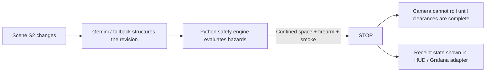
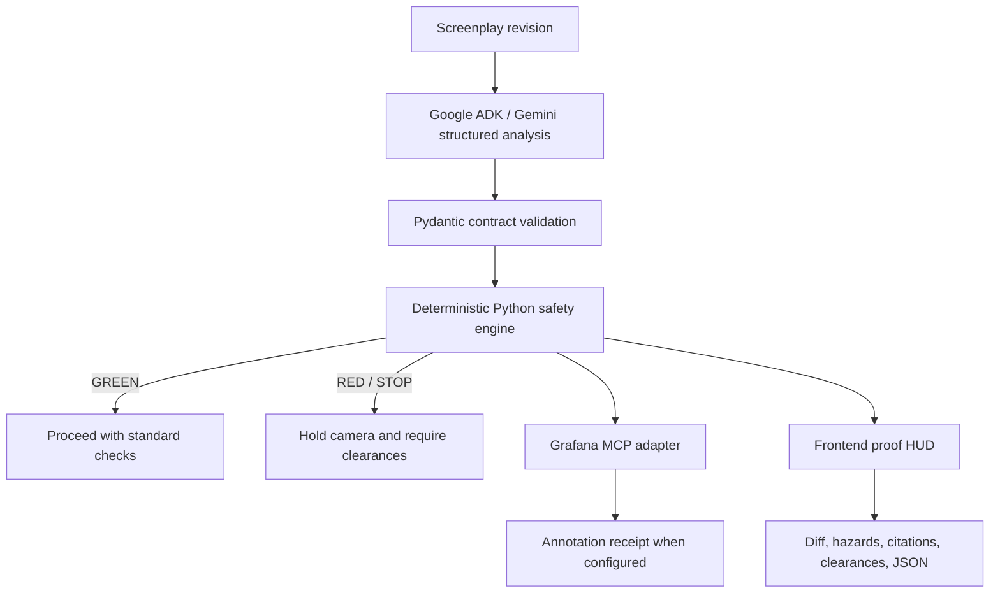

# Universal CallSheet

> **AI can identify what changed in a screenplay. Deterministic safety rules decide whether the camera may roll. Grafana receives the receipt after that gate.**

Universal CallSheet is a proof-first production safety agent for film crews. It turns a last-minute screenplay revision into a stage decision, required sign-offs, and an auditable evidence trail.

## Start Here

| What | Link |
| --- | --- |
| Live app | https://universal-callsheet.vercel.app |
| Demo video | https://youtu.be/XzUXE0kLOAs |
| Source branch | `frontend-deploy` |
| Best judge path | Open the app, keep Auto-review on, select S2, inspect STOP, clearances, JSON, and receipt state. |

For judges: watch the 99-second demo first for the story, then use the live app to replay the S2 refusal path.

## The Moment That Matters



The product in one sentence: creative AI is allowed upstream; deterministic permission is required downstream.

## Why Universal CallSheet?

Film revisions can change physical work faster than safety paperwork changes. One new line can introduce firearms, atmospheric smoke, restricted egress, pyrotechnics, heights, rigging, or powered equipment before every department has updated its plan.

Universal CallSheet gives the model a narrow job and gives the safety decision a hard boundary:

- **Structured extraction:** Google ADK/Gemini turns revision text into strict `DiffOutput`, `CascadeOutput`, and `HazardTagOutput` objects.
- **Deterministic gate:** Python safety rules own `GREEN`, `RED`, and `STOP`. The model does not decide whether camera may roll.
- **Bounded automation:** Auto-review can submit a selected scenario, but it still goes through the same backend validation and safety gate.
- **Receipt discipline:** The HUD labels live requests, static snapshots, fallback mode, and Grafana receipt state separately.

## Replay the Proof

| Step | What you will see | Why it matters |
| --- | --- | --- |
| 1 | S2 is the default proof path: confined-space firearm shootout | Concrete safety consequence, not a generic feature tour |
| 2 | Auto-review submits the revision to `/api/analyze` | Agentic behavior is bounded and visible |
| 3 | The safety engine returns `STOP` | The camera-roll decision is deterministic |
| 4 | Required clearances appear | The result creates operational next actions |
| 5 | Raw backend JSON and runtime chain are inspectable | The user can verify what happened |
| 6 | Grafana state is labeled exactly as returned | The project avoids pretending a receipt exists when it does not |

## System Path



## Claim-Proof Ledger

We use a strict vocabulary so the README does not make a stronger claim than the code, tests, deployment, or receipt supports.

| Claim | Status | Evidence |
| --- | --- | --- |
| Hosted project URL | Verified | Production Vercel URL returns 200 and serves the judge demo reel. |
| Demo video | Verified | Public YouTube demo: https://youtu.be/XzUXE0kLOAs |
| S2 refusal path | Tested | UI smoke test verifies selecting S2 reaches `STOP`. |
| Structured screenplay analysis | Tested / fallback-safe | Google ADK pipeline and schema tests exist; fallback mode is labeled in the HUD. |
| Safety decision | Tested | `engine.safety.evaluate_safety` owns the decision; refusal paths are covered by tests. |
| Auto-review | Tested | UI and API tests verify `trigger: auto_review` and the automatic review path. |
| Local Grafana MCP | Verified locally | Official `mcp-grafana` stdio path created annotations during local verification. |
| Hosted Grafana MCP | Supported / unverified | Streamable HTTP configuration exists, but no hosted MCP receipt is claimed unless the backend returns one. |
| Public repository | Submission requirement | The repo owner must make the repository public before final judging. |

## Judge Lens

Official requirement: the project must be a functional Gemini/Google Cloud agent, include a hosted project URL, include a public demo video, include a public open-source repository, and demonstrate runtime use of the chosen partner service rather than merely naming it.

Strong judge signals in this submission:

- **Problem clarity:** screenplay revisions can introduce regulated hazards before call sheets and department plans catch up.
- **Complete product experience:** the app gives a first assistant director a review surface, decision, evidence, and next action.
- **Meaningful technology use:** Gemini/ADK structure ambiguous text; deterministic code owns the safety boundary; Grafana is treated as the post-gate receipt layer.
- **Impact:** the memorable outcome is a refusal: the system explains why the camera cannot roll.
- **Trust:** fallback and receipt states are labeled instead of hidden.

## Built With

- Google ADK and Gemini for structured screenplay extraction.
- Python, FastAPI, Pydantic, and deterministic safety rules.
- Official Grafana MCP support through local stdio and hosted Streamable HTTP configuration.
- Vanilla HTML, CSS, and JavaScript for the proof HUD.
- Vercel-compatible FastAPI routing.

## Run Locally

```powershell
python -m pip install -e .
python -m uvicorn src.main:app --host 127.0.0.1 --port 8003
```

Open:

```text
http://127.0.0.1:8003/
```

Run backend tests:

```powershell
python -m pytest -q
```

Run browser tests with installed Chrome:

```powershell
npm install
$env:PLAYWRIGHT_CHROME_PATH='C:\Program Files\Google\Chrome\Application\chrome.exe'
$env:BASE_URL='http://127.0.0.1:8003/'
npm run test:ui
```

## Environment

Keep all credentials server-side. The browser reads only the JSON response; it never receives these values.

Gemini:

```text
GEMINI_API_KEY=<server-side key>
GEMINI_MODEL=gemini-3.7-flash
```

Hosted Grafana MCP:

```text
GRAFANA_MCP_URL=https://<hosted-mcp-service>/mcp
GRAFANA_MCP_SERVER_TOKEN=<server-side token>
GRAFANA_PUBLIC_URL=https://<grafana-host>
GRAFANA_MCP_TIMEOUT_SECONDS=20
```

Never expose these variables as browser or `NEXT_PUBLIC_*` variables.

For Vercel, configure the same variables in the project environment settings. A hosted `GRAFANA_MCP_URL` is required for production MCP publishing; local stdio is not available inside Vercel serverless functions.

## Limitations

- Local stdio Grafana MCP is verified. Hosted MCP is supported but remains unverified until a real hosted endpoint returns a receipt.
- Vercel serverless SQLite history is ephemeral; the live POST response is the source of truth.
- Only the encoded Alberta OHS hazard rules are covered.
- Universal CallSheet is an assistive hackathon prototype, not legal advice or a replacement for qualified safety leadership or regulators.
- The repository must be made public by the repo owner for final hackathon compliance.

## Compliance and Provenance

This repository contains new Universal CallSheet implementation work. It does not copy private implementation code, credentials, receipts, or assets from other projects.

The reusable pattern is the proof architecture: AI proposes or extracts, deterministic code gates, the external tool receives only cleared output, and the UI shows the receipt state.
