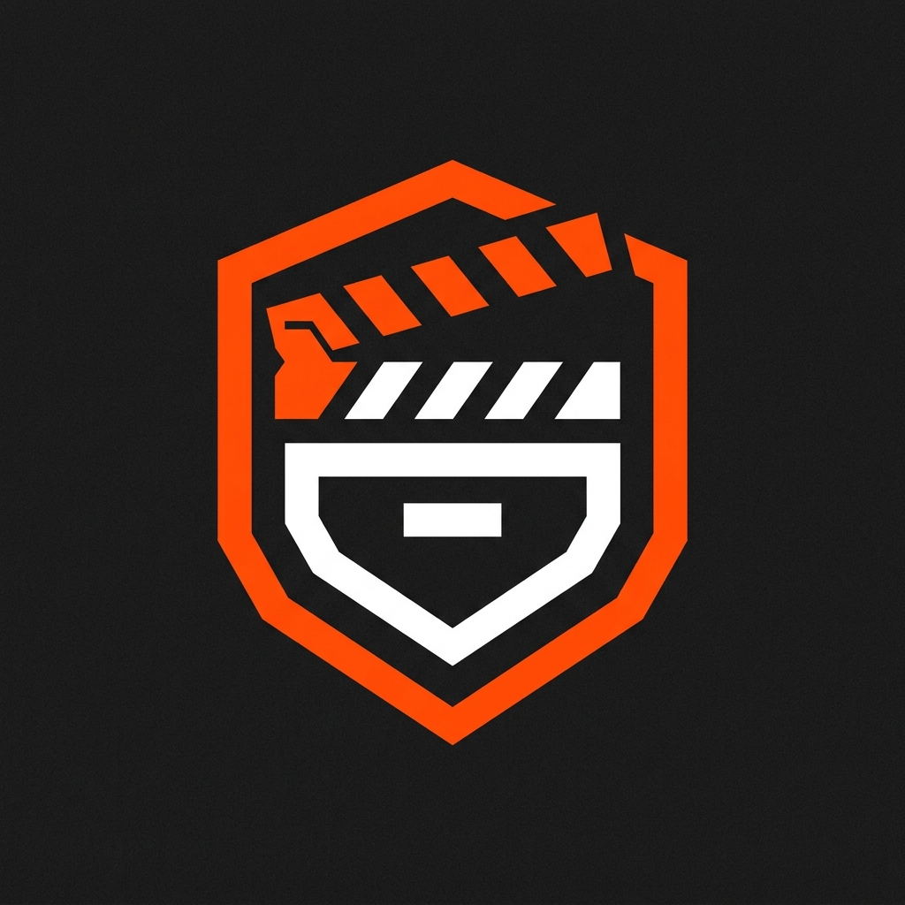
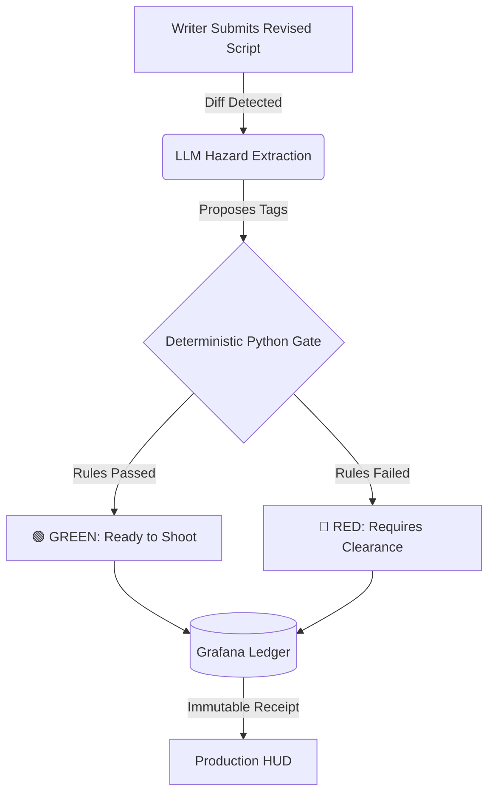

<div align="center">
  
  <h1>Universal CallSheet (UCS)</h1>
  <p><b>AI-powered Safety Governance for Film Production</b></p>
  
  [](#)
  [](#)
  [](#)
  [](#)
</div>

---

## 🎬 The Problem: Script Changes Outpace Safety Protocols
Film script rewrites happen faster than safety paperwork can keep up. When high-risk hazards (pyrotechnics, heights, weapons) are added at the last minute without clearing the proper departments, **people get hurt**. A manual safety gap on a busy, fast-moving set is a critical liability.

## 💡 The Solution: Universal CallSheet
**Universal CallSheet (UCS)** acts as an automated safety gate between the writer's room and the production floor. 

It uses Google Gemini to read screenplay diffs, instantly extracts physical hazards, routes them through deterministic Python safety rules (Alberta OHS Code), and publishes immutable safety receipts to a Grafana dashboard—ensuring no dangerous stunt ever bypasses the safety team.

---

## ⚙️ How It Works (The Pipeline)



1. 📝 **LLM Extraction:** Google ADK and Gemini `3.7-flash` extract structured elements from raw script revisions.
2. 🛑 **Deterministic Gate:** The Python safety engine enforces Alberta OHS Code AR 191/2021 to set a final severity.
3. 📊 **Immutable Logging:** Verified hazard tags are routed to Grafana MCP for permanent annotation.
4. 🖥️ **Production HUD:** The frontend displays the un-falsifiable stage decision and receipt.

---

## 🚀 Deployment & Demo

For this hackathon, we have deployed the fully functional portal to Vercel and recorded a complete technical demo of the pipeline in action. 

<div align="center">
  <a href="https://universal-callsheet.vercel.app"></a>
  &nbsp;&nbsp;
  <a href="https://youtube.com/watch?v=demo_placeholder"></a>
</div>

---

## 🧪 Testing & Validation
We believe in proving our code. UCS includes automated testing for both backend logic and frontend UI.
```powershell
# Run backend pipeline tests
python -m pytest -q

# Run Playwright UI smoke tests
npm ci
$env:PLAYWRIGHT_CHROME_PATH='C:\Program Files\Google\Chrome\Application\chrome.exe'
$env:BASE_URL='http://127.0.0.1:8000/'
npm run test:ui
```

---

## ⚖️ Hackathon Compliance & Transparency
- **Net-New Code:** The frontend UI, FastAPI backend, deterministic rules engine, and ADK pipeline integration were all created natively for this hackathon.
- **Strict Dependencies:** UCS relies strictly on Google ADK, Gemini, Grafana MCP, FastAPI, and Playwright. *No unauthorized LLMs were used.*
- **Honest Fallbacks:** Our architecture natively supports a deterministic `offline_fallback` mode if the Gemini API is unreachable, ensuring no "hallucinated" safety checks ever occur.
- **Limitations:** The live Vercel environment uses a placeholder URL for the Grafana MCP endpoint. Serverless execution is ephemeral.

> **Disclaimer:** UCS is a hackathon prototype for safety workflow assistance. It is not legal advice and does not replace production safety leadership, qualified workers, or regulatory authorities.
