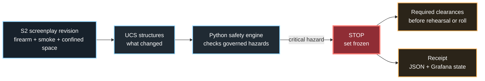
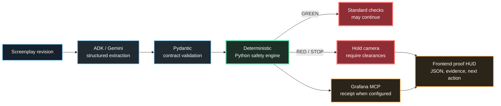
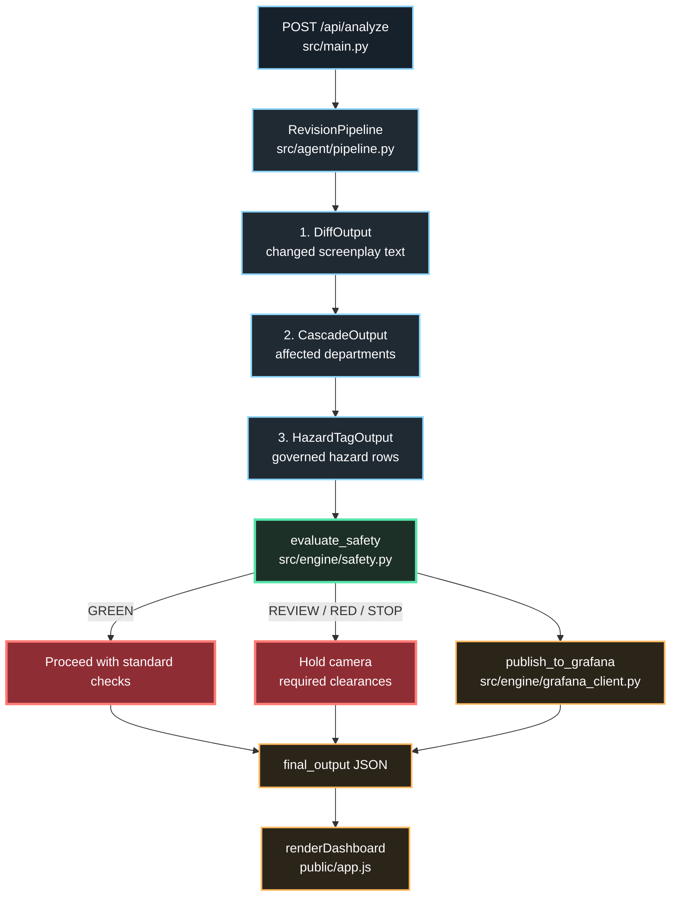
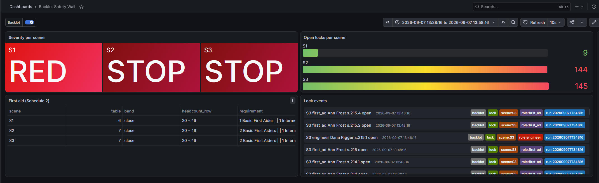

<p align="center">
  
</p>

<h1 align="center">Universal CallSheet</h1>

<p align="center">
  <strong>AI structures screenplay changes. Deterministic safety rules decide whether the camera can roll.</strong>
</p>

<p align="center">A proof-first safety review cockpit for film productions.</p>

<p align="center">
  <a href="https://universal-callsheet.vercel.app">Live app</a>
  &nbsp; | &nbsp;
  <a href="https://youtu.be/XzUXE0kLOAs">Demo video</a>
  &nbsp; | &nbsp;
  <a href="docs/ARCHITECTURE.md">Architecture</a>
  &nbsp; | &nbsp;
  <a href="docs/DEVPOST_SUBMISSION.md">Submission copy</a>
</p>

<p align="center">
  <code>Google ADK</code>
  <code>Gemini</code>
  <code>FastAPI</code>
  <code>Python safety engine</code>
  <code>Grafana MCP</code>
  <code>Vercel</code>
</p>

## The Product

A late screenplay revision can introduce a firearm, smoke, a confined space, a stunt, or powered equipment after the production plan is already in motion. Universal CallSheet turns that revision into a reviewable production record:

`changed text -> affected departments -> hazard evidence -> stage decision -> required clearances -> receipt`

The memorable outcome is intentionally simple: when a critical hazard is present, the system says `STOP`, explains why, and shows what must happen next.

## Start Here

Use the header links in this order: demo video for the plain-English story, live app for the S2 refusal path, then architecture notes for the source-level explanation.

For judges: watch the demo first, then use the live app to verify the same refusal outcome.

## The Moment That Matters



This is the product in one sentence: AI may interpret the revision, but deterministic permission is required before the camera can roll.

## See The Proof First

Use the live app from the header and select `S2` in the scenario deck. The proof surface is the same in the demo and in the deployed product: a concrete revision, a deterministic `STOP`, required clearances, and an inspectable receipt.

### Replay the proof

1. Open the live app and keep `Auto-review` enabled.
2. Select `S2: Confined Space Prop Firearm Shootout`.
3. Watch the revision move through structured analysis and the deterministic safety engine.
4. Read the `STOP` decision, affected teams, and required clearances.
5. Open the evidence panels and raw JSON to verify the result instead of trusting a claim.

| What you will see | Why it matters |
| --- | --- |
| S2 adds a blank firearm discharge and atmospheric smoke | A concrete production change, not an abstract AI demo |
| `DiffOutput`, `CascadeOutput`, and `HazardTagOutput` | The model work is structured and inspectable |
| `STOP` from the Python safety engine | Final authority is deterministic and testable |
| Required armorer, safety, and rescue clearances | The result creates an operational next step |
| Raw JSON and receipt state | The visible story maps back to a backend response |

## The System Flow



## Why The Boundary Matters

The model is useful for interpreting ambiguous screenplay language. It is not trusted with the final permission decision.

| Layer | Responsibility | Evidence in this repo |
| --- | --- | --- |
| Google ADK / Gemini | Extract changes, department impact, and governed hazard tags | `src/agent/pipeline.py`, `src/agent/models.py` |
| Pydantic contracts | Reject malformed structured output | `src/agent/models.py`, API tests |
| Python safety engine | Map hazard rows to `GREEN`, `REVIEW`, `RED`, or `STOP` | `src/engine/safety.py` |
| Grafana MCP adapter | Publish significant results as an annotation when configured | `src/engine/grafana_client.py` |
| Frontend HUD | Show the decision, evidence, provenance, and next action | `public/index.html`, `public/app.js` |

The frontend checklist records sign-off progress; it cannot override a backend `STOP` verdict. That rule is covered by a browser regression test.

## Code Flow



| Stage | Runtime responsibility | Source |
| --- | --- | --- |
| 01 | Resolve a preloaded or custom scene and accept the revision request | `src/main.py` |
| 02 | Produce schema-constrained diff, cascade, and hazard outputs | `src/agent/pipeline.py` |
| 03 | Apply hazard-row rules without an LLM in the decision loop | `src/engine/safety.py` |
| 04 | Attempt the official Grafana MCP annotation for significant outcomes | `src/engine/grafana_client.py` |
| 05 | Return one JSON record and render the proof HUD | `src/main.py`, `public/app.js` |

The same path is available in live Gemini mode and in the clearly labeled local fallback. Fallback keeps the demo reviewable; it does not pretend to be a Gemini receipt.

## Verified Visual Receipt

The local Grafana path was verified with a Backlot Safety Wall showing scene severity and open locks. Hosted Grafana publishing is supported, but the live app labels it as published only when the current backend request returns a receipt.

<p align="center">
  
</p>

## Evidence Status

| Capability | Status | Source of truth |
| --- | --- | --- |
| Vercel deployment | Verified | `Live app` link in the header |
| Public demo video | Verified | `Demo video` link in the header |
| S2 refusal path | Tested | `tests/ui-smoke.spec.js` |
| Deterministic safety decision | Tested | `tests/test_safety_engine.py`, `src/engine/safety.py` |
| Structured analysis path | Tested and fallback-safe | `tests/test_agent_pipeline.py`, `src/agent/pipeline.py` |
| Auto-review workflow | Tested | `tests/ui-smoke.spec.js`, `src/main.py` |
| Local Grafana MCP write path | Verified locally | `src/engine/grafana_client.py`, `docs/wall.png` |
| Hosted Grafana MCP | Supported, unverified | Requires a configured hosted MCP endpoint and returned receipt |
| Public repository | Pending owner action | The repository owner must change GitHub visibility to public |

The app distinguishes live requests, structured fallback, history snapshots, static snapshots, and Grafana receipt state. No live Gemini or hosted Grafana claim should be inferred when the corresponding status is not visible in the current response.

## Run Locally

```powershell
python -m pip install -e .
python -m uvicorn src.main:app --host 127.0.0.1 --port 8003
```

Open [http://127.0.0.1:8003](http://127.0.0.1:8003).

No credentials are needed for the local proof path; the app uses its clearly labeled structured fallback when Gemini is unavailable.

Run the backend tests with:

```powershell
python -m pytest -q
```

For the responsive browser suite:

```powershell
npm install
$env:PLAYWRIGHT_CHROME_PATH='C:\Program Files\Google\Chrome\Application\chrome.exe'
$env:BASE_URL='http://127.0.0.1:8003/'
npm run test:ui
```

The browser suite covers the desktop, laptop, tablet, and mobile HUD, the custom revision path, automatic S2 review, navigation, and the rule that a `STOP` cannot be overridden by checking clearances.

## Scope And Limitations

- This is an assistive hackathon prototype, not legal advice and not a replacement for qualified safety leadership or regulators.
- The governed hazard mapping currently targets the Alberta OHS model encoded in `src/engine/safety.py` and its supporting data files.
- SQLite history on Vercel is best-effort and ephemeral; the live POST response is the source of truth.
- Hosted Grafana publishing is not claimed until a configured endpoint returns a verified MCP receipt.

## Final Hackathon Submission

This submission is maintained from a collaborator lane covering the current ADK/Gemini agent and product implementation, deterministic safety integration, Grafana MCP path, reliability work, deployment, tests, and judge-facing materials. The repository owner provides the upstream production-safety foundation, domain and jurisdiction data, repository governance, final merge control, credentials, and GitHub visibility. The repository history supports one shared hackathon solution: AI structures the revision, deterministic rules decide, and the crew receives a proof-backed next action.

- [Watch the demo video](https://youtu.be/XzUXE0kLOAs)
- [Launch the live app](https://universal-callsheet.vercel.app)
- [Read the architecture](docs/ARCHITECTURE.md)
- [Open the submission copy](docs/DEVPOST_SUBMISSION.md)
- [Explore the GitHub repository](https://github.com/deveraux-dev/google-cinema-hacka)

Submission readiness: the hosted app, public demo video, code-flow documentation, test evidence, and local Grafana proof are prepared. The repository owner must make the GitHub repository public before final submission.
