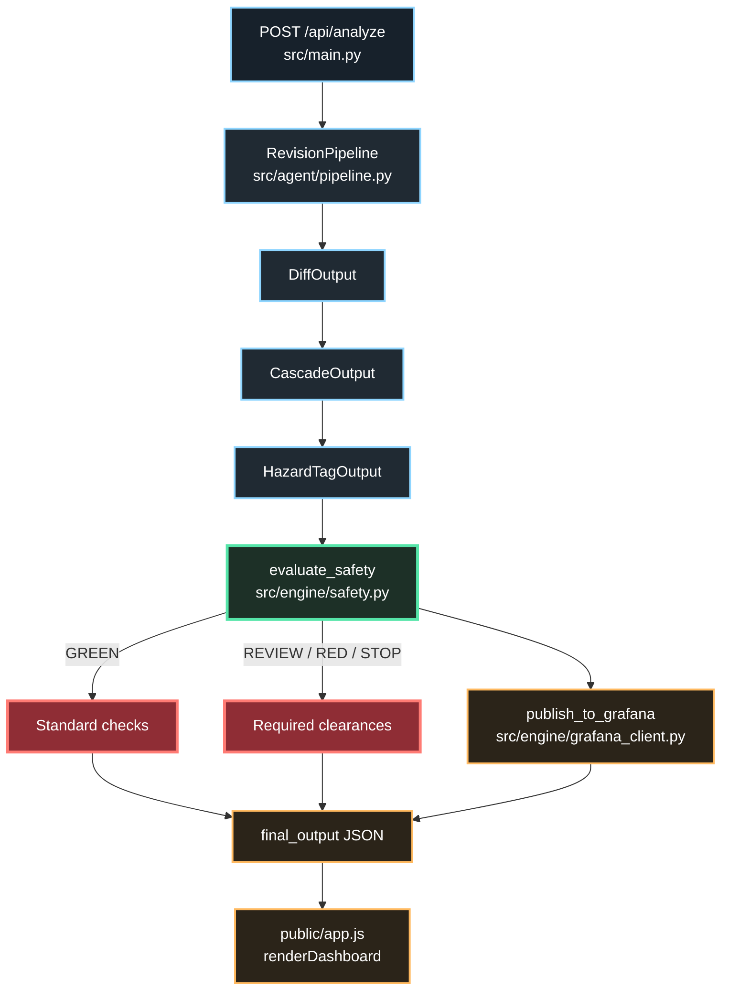

# UCS Architecture

UCS is a FastAPI application with a static browser HUD. The browser and API are
served from one origin so the frontend calls relative `/api/*` routes.

## Code Flow



The API accepts either a preloaded scenario or a custom original/revised scene.
The pipeline then emits three typed artifacts in order: `DiffOutput`,
`CascadeOutput`, and `HazardTagOutput`. The safety engine consumes only the
validated hazard rows and owns the final severity. Grafana publication and HUD
rendering consume the resulting record; neither can change the safety verdict.

```text
screenplay revision
        |
        v
Google ADK + Gemini structured analysis
DiffOutput -> CascadeOutput -> HazardTagOutput
        |
        v
Pydantic validation
        |
        v
deterministic Python safety engine
        |
        +--> FastAPI JSON response --> browser HUD
        |
        +--> official Grafana MCP create_annotation --> receipt
```

## Boundaries

The model extracts changes, department impacts, and hazard rows. The model never
chooses `GREEN`, `REVIEW`, `RED`, or `STOP`. `engine.safety.evaluate_safety` owns
that decision from the hazard-row lookup table and required clearances.

If Gemini is unavailable or quota-limited, the pipeline returns a clearly marked
schema-compatible fallback. This preserves the safety review workflow without
claiming that the fallback is Gemini output.

## Grafana MCP

Local development launches the official `grafana/mcp-grafana` server with stdio,
normally through `uvx mcp-grafana`. Production can use the same official server
hosted separately with Streamable HTTP at `GRAFANA_MCP_URL`; the Vercel function
does not launch a local subprocess. Grafana credentials remain server-side.

The client publishes only significant `REVIEW`, `RED`, and `STOP` results, parses
the MCP annotation receipt, and reports failures without changing the safety
verdict.

## Vercel behavior

Vercel detects `src.main:app` through the `tool.vercel.entrypoint` setting. Static
files live in `public/`. The deployed bundle is treated as read-only: live analysis
returns its JSON directly, while SQLite history is best-effort and ephemeral.
Cached responses carry a runtime delivery marker so the HUD cannot present a
historical receipt as a fresh live operation.

## Trust and limitations

- Script text and prior model outputs are treated as untrusted data in prompts.
- Hazard rows are constrained to the governed 1-13 ladder.
- This is safety workflow assistance, not legal advice or a substitute for a
  qualified safety professional.
- Hosted Grafana MCP and live Gemini completion require deployment credentials and
  must be separately verified with runtime receipts.
